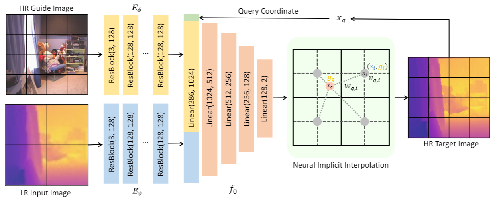

# Joint Implicit Image Function for Guided Depth Super-Resolution

This repository contains the code for:

> [Joint Implicit Image Function for Guided Depth Super-Resolution]()  
> Jiaxiang Tang, Xiaokang Chen, Gang Zeng  
> ACM MM 2021  





### Installation

Environments:
* Python 3.6
* PyTorch 1.8.0
* tensorboardX
* tqdm, opencv-python, Pillow
* [NVIDIA apex](https://github.com/NVIDIA/apex)


### Data preparation

Please see [data/prepare_data.md](data/prepare_data.md) for the details.


### Training
You can use the provided scripts (`scripts/train*`) to train models.

For example:

```bash
# train JIIF with scale = 8 on the NYU dataset.
OMP_NUM_THREADS=8 CUDA_VISIBLE_DEVICES=2 python main.py \
    --name jiif_8 --model JIIF --scale 8 \
    --sample_q 30720 --input_size 256 --train_batch 1 \
    --epoch 200 --eval_interval 10 \
    --lr 0.0001 --lr_step 60 --lr_gamma 0.2
```


### Testing

To test the performance of the models on difference datasets, you can use the provided scripts (`scripts/test*`). 

For example:  

```bash
# test the best checkpoint on MiddleBury dataest with scale = 8
OMP_NUM_THREADS=8 CUDA_VISIBLE_DEVICES=1 python main.py \
    --test --checkpoint best \
    --name jiif_8 --model JIIF \
    --dataset Middlebury --scale 8 --data_root ./data/depth_enhance/01_Middlebury_Dataset
```


### Pretrained models and Reproducing

We provide the pretrained models [here](https://drive.google.com/drive/folders/1qU669OhhGcIgxYtj-1J6APZdUKQOZ4H2?usp=sharing). 

To test the performance of the pretrained models, please download the corresponding models and put them under `pretrained` folder. Then you can use `scripts/test_jiif_pretrained.sh` and `scripts/test_denoise_jiif_pretrained.sh` to reproduce the results reported in our paper.


### Citation

If you find the code useful for your research, please use the following BibTeX entry:
```

```


### Acknowledgement

The model structure of this codebase is borrowed from [liif](https://github.com/yinboc/liif).